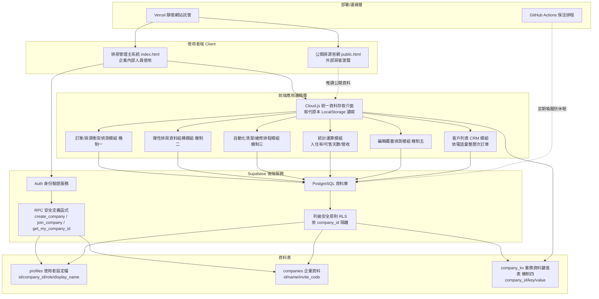
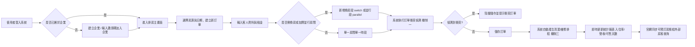
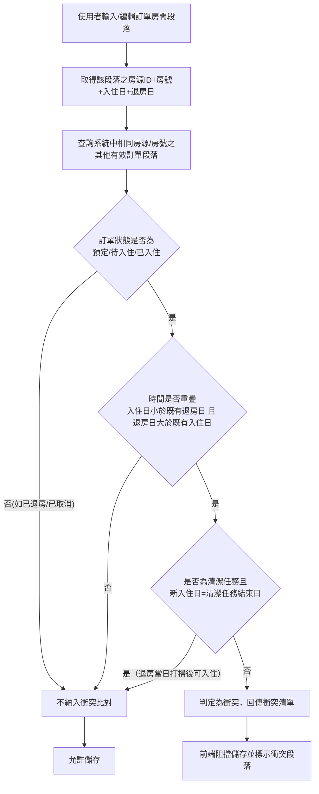
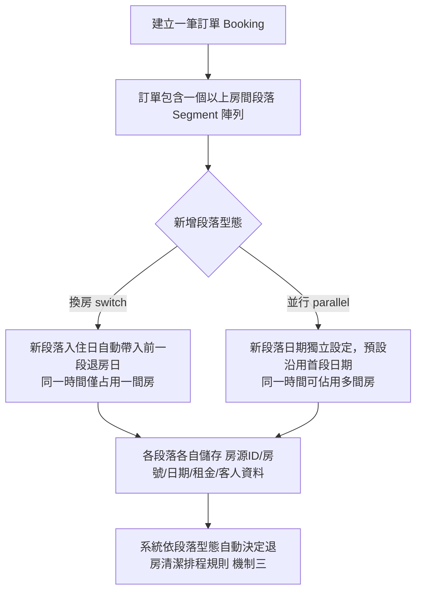
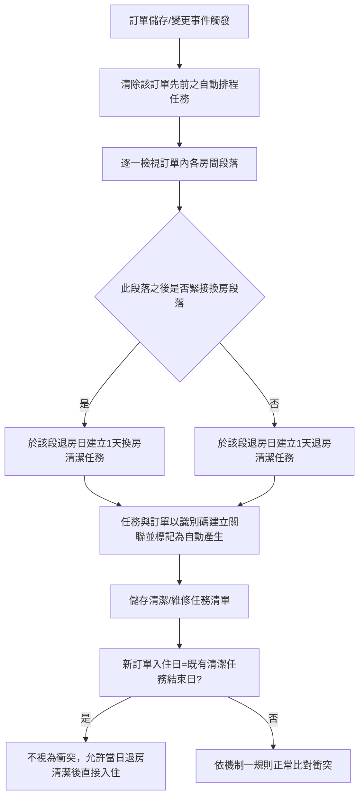
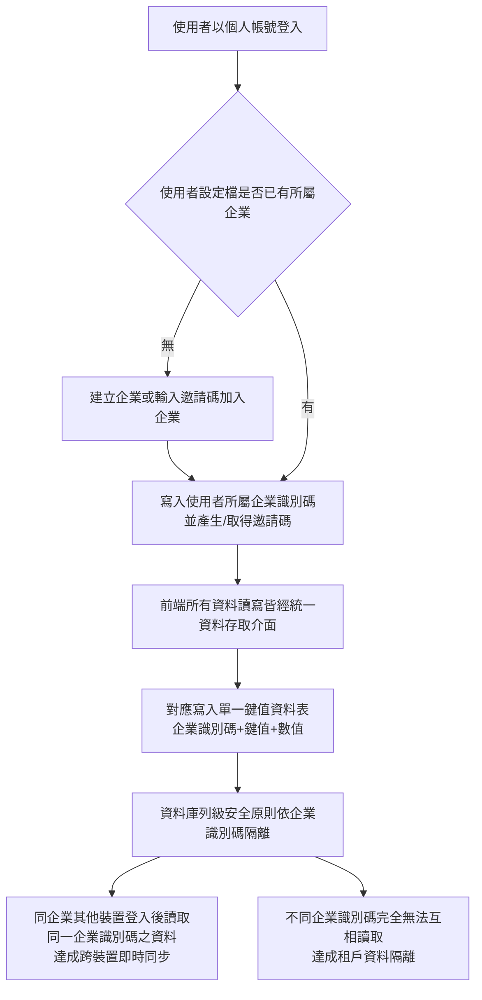
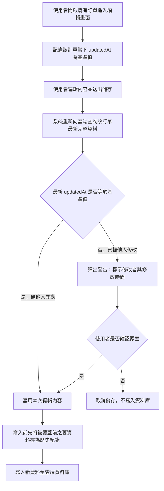

# 短租排房系統｜專利申請技術說明資料（草稿）

> 用途：供專利事務所/專利師審核評估用。本文件所有請求項（申請專利範圍）皆為**初稿示意**，正式撰寫需由專利師依專利檢索結果與策略調整，不可直接作為送件文件使用。

---

## 0. 專利類型評估建議

依台灣專利法規定：
- **新型專利**限定於「物品之形狀、構造或組合」，本系統為純軟體／雲端服務，**不具備實體物品的形狀構造**，原則上不符合新型專利之申請標的。除非能包裝成「結合特定硬體裝置」的技術方案（例如結合智慧門鎖/房卡感應設備等 IoT 硬體），否則新型專利路線大機率會被核駁或需大幅限縮範圍。
- **發明專利**可保護電腦實施之方法與系統，但審查時容易被質疑「單純營運管理方法（商業方法）不具技術性」。本文件在撰寫時，已刻意將重點放在「用演算法/資料結構解決技術問題」的部分（見第 2 章五大機制），以增加技術性論述的說服力，而非停留在「怎麼管理房源、怎麼算入住率」這類純商業邏輯層面。

**建議**：以發明專利為主要申請方向；新型專利是否併行，請專利師依正式前案檢索結果與客戶預算決定。本文件兩種類型的基礎素材皆已備妥。

---

## 1. 系統概述

「短租排房系統」是一套 B2B 多租戶 SaaS 系統，服務短租/民宿業者進行跨房源、跨房型的訂單排程、房源衝突管理、清潔維修排程自動化，並將公開房源即時同步至對外官網供房客查詢。系統採用 Supabase（PostgreSQL + Row Level Security）作為後端，前端為單頁式 Web 應用。

---

## 2. 核心技術機制（申請專利範圍之主要依據）

以下五項機制為本次擬申請專利之技術核心，每項皆包含：技術問題 → 技術手段 → 技術功效 → 流程圖 → 請求項初稿。

### 機制一：訂單／房源衝突偵測機制 ★（建議之主要獨立請求項）

**技術問題**：傳統排房作業（含人工排房與部分現有系統）在同一房源、同一房號被重複指派給不同訂單時，容易因人工疏忽或系統未即時比對而發生「雙重預訂」，且既有系統多半採取「整日獨占」的粗略比對邏輯，無法正確處理「退房日＝入住日」這種業界正常換房作業情境，導致系統誤判衝突或誤判無衝突。

**技術手段**：
1. 系統於使用者輸入或編輯訂單之房間時段（房源ID、房號、入住日、退房日）時，即時查詢資料庫中相同房源房號之其他訂單時段。
2. 僅將訂單狀態屬於「預定／待入住／已入住」者納入比對（已退房、已取消狀態不參與比對），縮減誤判範圍。
3. 採區間重疊演算法判定：`新入住日 < 既有退房日` 且 `新退房日 > 既有入住日`，方判定為時間重疊。
4. 針對「清潔任務」與「退房當日=入住當日」之特殊情境，額外排除規則：若重疊起因為前一組退房清潔任務、且新訂單入住日恰為該清潔任務結束日，則不視為衝突（對應業界「退房打掃後即可入住」之實務流程）。
5. 偵測到衝突時，系統於前端即時阻擋儲存動作，並標示衝突之段落與既有訂單資訊，防止衝突資料寫入資料庫。

**技術功效**：以演算法取代人工比對，於資料寫入前即攔截衝突，避免資料庫產生無法追溯之雙重預訂錯誤資料，同時避免既有系統「整日獨占」邏輯造成之誤判，提升系統資料正確性與可用房源利用率。

**流程圖**：見附圖一。

**請求項初稿（方法項示意）**：
> 一種訂單房源衝突偵測方法，應用於短租房源管理系統，包含下列步驟：
> (a) 接收一訂單資料，其包含至少一房源時段區段，該區段包含房源識別碼、房號、入住日期及退房日期；
> (b) 查詢該系統中與該房源識別碼及房號相同之既有訂單時段區段；
> (c) 篩選狀態屬於預定、待入住或已入住之既有訂單時段區段；
> (d) 判斷該訂單時段區段與前述既有訂單時段區段是否符合時間重疊條件；
> (e) 若符合時間重疊條件，進一步判斷該重疊是否為清潔任務且其退房清潔結束日等於該訂單之入住日期，若是則排除該重疊之衝突判定；
> (f) 若步驟(d)判定為重疊且未被步驟(e)排除，則判定為衝突，並阻擋該訂單資料之儲存。

---

### 機制二：彈性排房資料結構（同訂單多房型換房/並行管理）

**技術問題**：短租訂單常見「一位客人入住期間需更換房間」或「一組客人同時入住多間房」之情境，既有系統多以「一訂單對應一房間」為資料模型，遇到換房或多房情境須拆成多筆獨立訂單，導致同一組客人之訂單資訊分散、難以追蹤與統計，且系統無法自動判斷「換房」與「多房並行」在退房清潔排程上的差異。

**技術手段**：
1. 訂單資料模型設計為「一訂單、多房間時段區段（Segment）陣列」之結構，每一區段獨立記錄房源、房號、入住/退房日、租金與住客資訊。
2. 區段分為兩種型態：
   - 「換房型（switch）」：新增區段之入住日自動帶入前一區段之退房日，形成時間上前後銜接、同一時間僅佔用一間房之序列關係。
   - 「並行型（parallel）」：新增區段日期預設沿用首區段日期，但可獨立修改，用於同一時間佔用多間房之情境。
3. 系統依區段型態自動決定其在機制三之排程規則（見下）。

**技術功效**：以單一資料結構同時支援「時間序列型」與「空間並行型」兩種訂房情境，避免資料庫產生分散、難以關聯的多筆獨立訂單，簡化訂單變更（如移除其中一間房不影響其他房間）與統計運算之複雜度。

**流程圖**：見附圖二。

**請求項初稿（系統/資料結構項示意）**：
> 一種短租訂單資料結構，包含一訂單主體及至少一房間時段區段，其中每一房間時段區段包含房源識別碼、房號、入住日期、退房日期及區段型態欄位；該區段型態欄位至少包含換房型及並行型兩種數值，其中換房型區段之入住日期依前一區段之退房日期自動設定，並行型區段之日期獨立於其他區段而可個別設定。

---

### 機制三：自動化清潔／維修排程演算法

**技術問題**：訂單異動（新增、修改、取消、換房）後，若仰賴人工排定清潔／維修工作，容易發生遺漏或與其他任務衝突；且「換房」與一般「退房」在清潔排程規則上不同（換房通常僅需排定中間房間的清潔，一般退房則每個結尾區段皆須排清潔），既有系統多未區分處理。

**技術手段**：
1. 訂單儲存或變更時，系統先清除該訂單先前產生之自動排程任務（以訂單ID關聯標記）。
2. 逐一檢視訂單之各房間時段區段：若該區段後方緊接一「換房型」區段，則僅於該區段退房日建立一筆「換房清潔」任務；否則於該區段退房日建立一筆「退房清潔」任務。
3. 清潔／維修任務與訂單以識別碼建立關聯並標記為系統自動產生，與人工建立之任務區隔。
4. 任務衝突比對時（機制一），系統對「清潔任務結束日＝新訂單入住日」之情境特別排除衝突判定（詳見機制一步驟(e)），對「維修任務」則不排除，維持硬性阻擋。

**技術功效**：訂單異動後自動、即時、規則化地產生對應清潔／維修排程，減少人工排程之遺漏風險，且能正確區分換房與退房兩種情境所需的清潔頻率與時間點，提升房務排程效率與正確性。

**流程圖**：見附圖三。

**請求項初稿（方法項示意）**：
> 一種訂房系統之清潔任務自動排程方法，包含：於一訂單資料異動時，清除該訂單先前產生之自動排程任務；逐一取得該訂單之各房間時段區段；判斷該區段之後是否緊接一換房型區段，若是則於該區段之退房日期建立一換房清潔任務，若否則建立一退房清潔任務；並將前述清潔任務與該訂單以識別碼建立關聯。

---

### 機制四：多租戶雲端同步架構

**技術問題**：中小型短租業者原有系統多採單機/單一帳號本地儲存（如瀏覽器 LocalStorage），無法支援企業內多位員工、多裝置即時同步資料，改採傳統多租戶架構常須為每個業務實體（房源、訂單、任務等）分別設計正規化資料表與對應之權限規則，開發與維運成本高、且既有本地資料難以低風險遷移。

**技術手段**：
1. 以單一鍵值資料表（company_kv，欄位為 company_id、key、value(jsonb)）鏡射原有本地儲存之多組資料鍵值結構，每一原有資料類別（如房源、訂單、任務等）對應一組 key。
2. 使用者帳號與企業（company）之關聯記錄於使用者設定檔（profiles）資料表，並透過安全定義函式（security definer function）取得使用者所屬企業識別碼，避免資料列級安全原則（RLS）規則於查詢時發生遞迴問題。
3. 前端所有資料存取皆透過統一之讀寫介面（對應原有本地儲存讀寫介面之替代實作），依目前使用者之 company_id 對 company_kv 資料表進行讀寫，同企業成員登入不同裝置後即可讀取到相同資料，達成即時同步；不同企業之 company_id 不同，資料庫層級即完全隔離，無法互相存取。

**技術功效**：以最小幅度資料結構變更（單一鍵值表取代多張正規化資料表），將原本單機本地儲存架構改造為多租戶雲端同步架構，大幅降低系統遷移之開發風險與維運複雜度，同時透過資料庫層級之安全原則達成企業間資料完全隔離。

**流程圖**：見附圖四。

**請求項初稿（系統項示意）**：
> 一種多租戶資料同步系統，包含：一使用者帳號資料表，記錄使用者識別碼與其所屬企業識別碼之對應關係；一鍵值資料表，包含企業識別碼欄位、鍵值欄位及數值欄位，用以儲存對應該企業之各類業務資料；一資料存取介面，依登入使用者之企業識別碼對該鍵值資料表進行讀取與寫入；及一列級安全原則，限制僅相同企業識別碼之資料得被讀取或寫入。

---

### 機制五：多人同時編輯訂單之覆蓋偵測機制

**技術問題**：機制四之多租戶雲端架構使同企業多位員工得以於不同裝置同時存取、編輯同一筆訂單資料，但也因此產生「遺失更新（lost update）」風險——若甲、乙兩位員工同時開啟同一筆訂單進行編輯，依傳統「後寫入者覆蓋先寫入者」之處理方式，較晚送出儲存之一方將在不知情的情況下，完全覆蓋另一方剛完成的異動，且系統未提供任何提示或追溯機制，資料錯誤不易察覺。

**技術手段**：
1. 使用者開啟一筆既有訂單進入編輯畫面時，系統記錄該訂單當下之最後修改時間戳記（updatedAt）作為本次編輯之基準值（baseUpdatedAt）。
2. 使用者送出儲存時，系統不直接以本機暫存之訂單清單覆蓋寫入，而是先重新向雲端資料庫查詢該訂單目前最新之完整資料。
3. 比對雲端最新資料之時間戳記與步驟1所記錄之基準值：若兩者相同，表示編輯期間無他人異動過該筆訂單，逕行套用變更並寫回；若兩者不同，表示該筆訂單已於使用者編輯期間被他人修改過。
4. 偵測到上述時間戳記不一致時，系統於前端彈出警告訊息，明確標示該筆訂單係遭何人（依修改者帳號顯示名稱）於何時修改，並要求使用者明確確認是否仍要繼續、以本次編輯內容覆蓋對方之異動；使用者可選擇取消儲存以避免覆蓋，或確認後繼續寫入。
5. 於實際寫入新資料前，系統另將被覆蓋前之舊資料快照存入歷史紀錄，以利事後追溯個別欄位之異動軌跡與覆蓋責任歸屬。

**技術功效**：以輕量化之樂觀鎖定（optimistic concurrency control）機制解決多租戶雲端同步架構下必然伴隨產生之多人同時編輯衝突問題，毋須導入即時協作鎖定伺服器或欄位級即時鎖定等高複雜度架構，即可有效防止資料遭無感覆蓋遺失，並透過覆蓋前歷史快照達成異動可追溯性，兼顧系統輕量化與資料完整性。

**流程圖**：見附圖五。

**請求項初稿（方法項示意）**：
> 一種多租戶系統中訂單編輯覆蓋偵測方法，包含下列步驟：
> (a) 於使用者開啟一訂單資料進行編輯時，記錄該訂單當時之一時間戳記作為基準值；
> (b) 於使用者送出儲存請求時，向資料庫重新查詢該訂單目前之最新時間戳記；
> (c) 比對該最新時間戳記與該基準值是否相同；
> (d) 若不相同，顯示一警告訊息，標示該訂單之修改者身分與修改時間，並待使用者確認是否仍執行覆蓋寫入；
> (e) 若使用者確認覆蓋或步驟(c)判定相同，則將被覆蓋前之資料存為一歷史紀錄後，寫入該使用者之編輯內容；
> (f) 若使用者不確認覆蓋，則取消本次儲存請求，不寫入資料庫。

---

## 3. 系統優勢與特點（摘要／簡報用）

1. **防呆性衝突偵測**：訂單儲存前即攔截房源時間衝突，且能正確辨識「退房打掃後同日入住」等業界實務情境，減少誤判。
2. **彈性排房資料結構**：同一組客人換房或多房入住，皆在單一訂單內完整記錄，避免資料分散。
3. **自動化清潔排程**：訂單異動即自動重新計算清潔/維修排程，無需人工介入。
4. **多租戶雲端架構**：以最小改動幅度達成企業級多人、多裝置即時同步與資料隔離。
5. **編輯覆蓋偵測**：多人同時編輯同一筆訂單時，以時間戳記比對即時偵測並提示覆蓋風險，避免資料遭無感覆蓋遺失。
6. **官網即時同步**：內部排房資料與對外官網房源展示同步更新，房客可即時查詢可預訂房態。
7. **帳號安全機制**：包含密碼強度規則、顯示名稱修改次數限制等帳號治理機制。
8. **統計即時運算**：入住率、年度可銷售天數、營業額等指標依當前檢視月份即時運算，不需另建報表批次程序。

---

## 4. 系統架構圖（System Architecture，附圖A）

> 說明使用者路徑圖（第5章）著重「人」的操作順序；本圖著重「系統」的技術組成分層與資料流向，供專利師判斷技術實施架構、界定何處屬於雲端服務商（Supabase）之通用基礎設施、何處屬於本系統自行設計之技術手段（分層越清楚，越有助於專利師劃定申請專利範圍的邊界）。

**分層說明**：
- **使用者端**：企業內部使用之排房管理系統，與對外公開之房源展示官網，兩者共用同一後端資料來源但存取權限不同（機制四之資料隔離延伸應用）。
- **部署/邊緣層**：屬於通用雲端基礎設施（Vercel、GitHub Actions），非本次專利技術核心，僅作架構完整性說明。
- **前端應用邏輯層**：本系統自行設計之核心技術手段所在，機制一～三及機制五之演算法模組皆運作於此層，並透過統一資料存取介面（Cloud.js）與後端溝通；另設有客戶列表（CRM）模組，依電話彙整同一房客歷次訂單，屬管理功能而非本次專利申請範圍之技術手段。
- **Supabase 後端服務／資料表**：機制四之多租戶架構實作所在；Auth、RLS、PostgreSQL 為 Supabase 提供之通用基礎服務，本系統之技術貢獻在於「如何設計 RPC 函式與資料表結構（company_kv 單一鍵值表）以最小改動達成多租戶隔離與同步」，而非重新發明資料庫底層機制，此區分有助於專利師界定申請專利範圍不會誤觸第三方平台之通用功能。

---

## 5. 使用者路徑圖（User Journey，附圖零）

---

## 6. 五大機制流程圖

### 附圖一：訂單／房源衝突偵測機制

### 附圖二：彈性排房資料結構（換房/並行）

### 附圖三：自動化清潔／維修排程演算法

### 附圖四：多租戶雲端同步架構

### 附圖五：多人同時編輯訂單之覆蓋偵測機制

---

## 7. 發明專利說明書所需資訊對照表

| 說明書項目 | 本文件對應內容 | 狀態 |
|---|---|---|
| 發明名稱 | 待專利師依範圍定稿，建議方向如「短租房源訂單衝突偵測與自動排程方法及系統」 | 待定稿 |
| 技術領域 | 第1章系統概述 | 已備妥 |
| 先前技術及其缺點 | 各機制「技術問題」段落（未含競品比較，依需求先不比較市場產品，如需要可另補） | 已備妥（部分） |
| 發明內容（目的/技術手段/功效） | 第2章各機制之技術手段、技術功效 | 已備妥 |
| 圖式簡單說明 | 第4章之附圖A、第5、6章之附圖零～五 | 已備妥（示意版，非正式專利圖式格式） |
| 實施方式 | 第2章技術手段細節，可依此擴寫 | 已備妥（需擴寫細節） |
| 申請專利範圍（請求項） | 各機制之請求項初稿 | **僅供參考，需專利師正式撰寫** |
| 摘要 | 第1、3章內容可供改寫 | 已備妥 |
| 正式前案檢索（新穎性/進步性查核） | 未執行（依指示暫不比較市場產品） | **建議由專利師執行正式專利檢索** |

---

## 8. 後續建議

1. 本文件流程圖為示意用 Mermaid 流程圖，非正式專利圖式格式，正式送件圖式需由專利師或專利繪圖人員依規定格式重新繪製（黑白線條圖、統一元件符號編號等）。
2. 雖依需求本次未比較市場上其他排房系統，但正式送件前強烈建議請專利師執行**正式專利前案檢索**（不同於一般市場產品調查），以確認新穎性與進步性，避免核駁風險。
3. 五項機制建議優先以「機制一：訂單/房源衝突偵測機制」作為主要獨立請求項，其餘機制可作為附屬項或分別申請，實際策略請與專利師討論（例如是否要包裝成單一整合系統的一個大專利，或拆成多件個別專利以分散風險、增加保護範圍）。
4. 系統目前尚未對外正式銷售，僅供內部業者試用，尚未產生公開發表/公開使用之新穎性喪失事由；若日後有意對外公開展示或銷售，建議於送件前完成，或確認可適用專利法第22條第3項優惠期（12個月內）並備妥相關證明文件。
