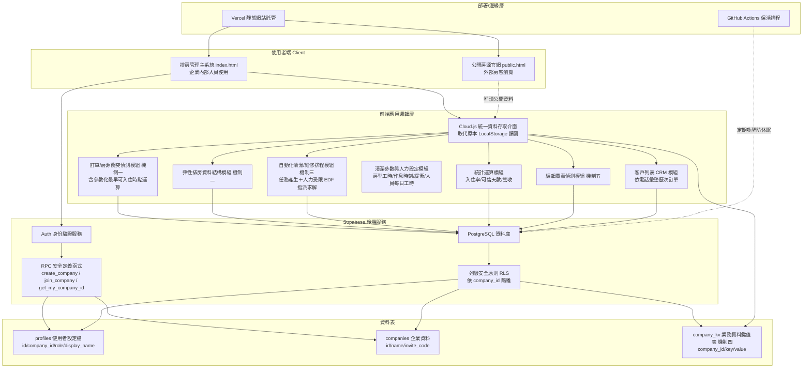
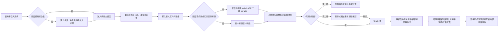
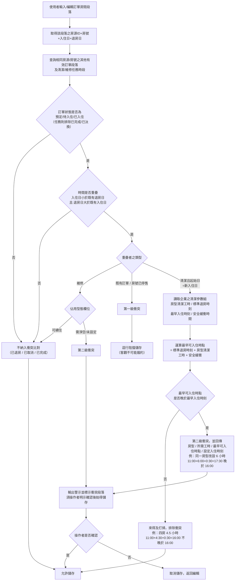
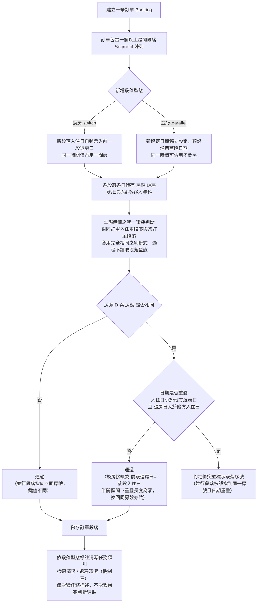
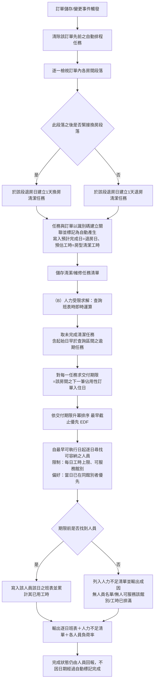
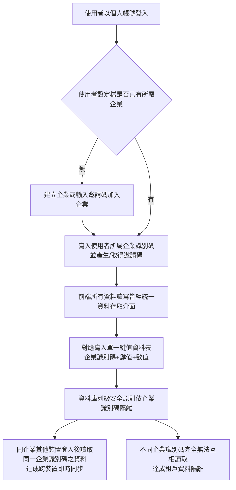
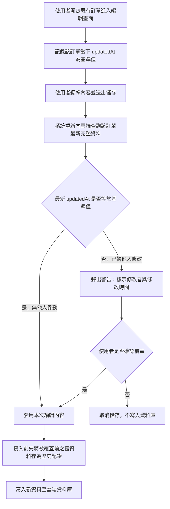

# 短租排房系統｜說明資料

---

## 1. 系統概述

「短租排房系統」是一套 B2B 多租戶雲端系統，協助短租/民宿業者管理房源、訂單與清潔排程，並將可預訂房態同步至對外官網。後端採用 Supabase（PostgreSQL + Row Level Security），前端為單頁式網頁應用。

---

## 2. 核心技術機制

### 機制一：訂單／房源衝突偵測機制

**技術問題**：多房源、多房號的排房作業中，若靠人工比對或系統邏輯過於簡略，容易把同一房間重複排給不同訂單。尤其「退房當天又有新客人入住」這種正常換房情境，傳統整日獨占式判斷邏輯常會誤判成衝突，或漏抓真正的衝突。

進一步的問題在於：即使系統做了「退房當日可再入住」的例外處理，若該例外是以固定規則寫死，仍會產生新的誤判。因為不同房型的清潔工時差距極大——一間分租雅房約需一小時，一戶四房則需四至六小時——在同樣「上午十一時退房、下午四時可入住」的作息下，雅房綽綽有餘，四房卻恰好卡在可行與不可行的臨界點上：工時四點五小時即勉強趕上，六小時則絕無可能。固定規則不論設為允許或禁止都會錯：設為允許，房客抵達時房間仍在清潔中，形成無法履約的訂單；設為禁止，則雅房的可售天數被無謂犧牲。**問題的本質是：例外條件是否成立，取決於房型工時、作息時間等連續量，不能以布林規則表示。**

**技術手段**：
1. 使用者輸入或修改訂單的房間時段（房源、房號、入住日、退房日）時，系統即時查詢同房源房號的其他訂單時段與清潔／維修任務時段。
2. 只比對狀態為「預定／待入住／已入住」的訂單，已退房或已取消的不列入比對；任務則排除已完成與已汰換者。
3. 用日期區間是否重疊來判斷：新訂單入住日早於既有訂單退房日，且新訂單退房日晚於既有訂單入住日，才算重疊。
4. **參數化緩衝時間之最早可入住時點運算**：系統維護一組企業層級之清潔參數，包含每一房型之清潔工時、標準退房時刻、最早入住時刻及安全緩衝時間。當重疊者為退房清潔任務且其起始日等於新訂單入住日時，系統不逕行放行，而是依下式即時運算該房間之最早可再入住時點：

   > 最早可入住時點 ＝ 標準退房時刻 ＋ 該房間所屬房型之清潔工時 ＋ 安全緩衝時間

   將該時點與企業設定之最早入住時刻比較：若不晚於最早入住時刻，判定當日換房可行，排除衝突；若晚於最早入住時刻，判定為衝突，並於提示訊息中一併回傳房型、所需工時、運算所得之最早可入住時點與設定之入住時刻，使操作者得據以選擇調整入住時間或增派人力。
5. **維修任務之佔用型態區分**：維修任務另設佔用型態欄位，區分「需淨空」與「可續住」兩種數值。需淨空者（如漏水修繕、地板重鋪）維持硬性擋單；可續住者（如更換燈泡、補漆）不影響房客入住，不列入衝突。未設定該欄位之既有資料，一律以需淨空處理，以維持向後相容且偏向安全側。
6. **依衝突性質分級處置**：判定為衝突時，系統依其可否由人為判斷化解而分為兩級。房源已停售、或與另一筆有效訂單直接重疊者，屬客觀上不可能履約，系統逕行阻擋儲存；與清潔／維修任務重疊者，因操作者仍可能以調整入住時刻、增派人力或改派房間等方式化解，系統輸出載明成因與運算結果之警示，並要求操作者明示確認後始得儲存。兩者皆標示是哪一筆訂單或任務造成衝突。此一分級使系統既不會放行不可能履約之訂單，亦不致因過度剛性而妨礙現場調度。

**技術功效**：
- 以演算法取代人工比對，在資料寫入前就攔截衝突。
- 例外條件由固定規則改為依房型與作息參數即時運算，使「可否當日換房」的判定隨房型自動變化，同時避免（a）對小房型過度保守而損失可售天數，與（b）對大房型過度樂觀而產生無法履約之訂單，兩類誤判。
- 參數由各企業自行設定，同一套演算法可適配作息與人力配置互異的不同業者，毋須改寫程式邏輯。
- 維修佔用型態之區分，使不影響住宿之輕微維修不再無謂鎖房。
- 衝突分級處置使系統對「客觀不可能」與「可經人為調度化解」兩類情形採取不同強度之處置，避免一律硬擋所導致的操作者繞道（如改用系統外的紙本或通訊軟體登記），使系統紀錄得以與實際房態保持一致。

**流程圖**：見附圖一。

**請求項初稿（方法項示意）**：
> 一種訂單房源衝突偵測方法，應用於短租房源管理系統，包含下列步驟：
> (a) 接收一訂單資料，其包含至少一房源時段區段，該區段包含房源識別碼、房號、入住日期及退房日期；
> (b) 取得一清潔參數組，其包含複數房型各自對應之清潔工時、一標準退房時刻、一最早入住時刻及一安全緩衝時間；
> (c) 查詢該系統中與該房源識別碼及房號相同之既有訂單時段區段及既有任務時段；
> (d) 篩選狀態屬於預定、待入住或已入住之既有訂單時段區段，並排除狀態屬於已完成或已汰換之既有任務時段；
> (e) 判斷該訂單時段區段與前述既有時段是否符合時間重疊條件；
> (f) 當該重疊者為一清潔任務且其起始日期等於該訂單之入住日期時，依該房號所屬房型取得對應之清潔工時，以該標準退房時刻加計該清潔工時及該安全緩衝時間，運算得一最早可入住時點；當該最早可入住時點不晚於該最早入住時刻時，排除該重疊之衝突判定；當該最早可入住時點晚於該最早入住時刻時，判定為衝突並輸出包含該房型、該清潔工時及該最早可入住時點之提示資訊；
> (g) 當該重疊者為一維修任務時，讀取該維修任務之佔用型態欄位，該欄位至少包含需淨空及可續住兩種數值；當該欄位為可續住時排除該重疊之衝突判定，當該欄位為需淨空或未設定時判定為衝突；
> (h) 依該衝突之來源將其分為第一級與第二級：當該重疊者為既有訂單時段區段，或該房號經標記為停售時，判定為第一級衝突並阻擋該訂單資料之儲存；當該重疊者為前述清潔任務或需淨空之維修任務時，判定為第二級衝突，輸出包含衝突成因及步驟 (f) 所得運算結果之警示資訊，並於接收到一使用者確認指令後始允許儲存該訂單資料。

**附屬項方向**：清潔工時得依房型以外之因素（如房間坪數、上一房客住宿天數、是否為長租退租）加權調整；安全緩衝時間得依館別分別設定。

---

### 機制二：彈性排房資料結構（同訂單多房型換房/並行管理）

**技術問題**：客人換房、或一次入住多間房是常見情境，但多數系統一張訂單只能對應一個房間，遇到這類情況就得拆成好幾筆獨立訂單，資料變得分散、難以追蹤。

而一旦允許單一訂單容納多個房間區段，隨即衍生一個新問題：**同一張訂單內部的區段之間也可能互相衝突**。換房型區段的日期是前後相接的，並行型區段的日期則是刻意重疊的——若排房系統把「日期重疊」一律視為錯誤，換房固然無虞，但正常的多房並行會被誤擋；若因為是同一張訂單就一律信任而不比對，則操作者誤把兩個並行區段指到同一間房並使日期重疊時，系統會毫無反應地讓同一間房在同一段期間被賣兩次。傳統做法多半是為換房與並行分別撰寫兩套判斷邏輯，區段型態一旦增加即須增修判斷分支。

**技術手段**：
1. 一張訂單可包含多個房間時段區段，每個區段各自記錄房源、房號、入住/退房日、租金與住客資料。
2. 區段分兩種：「換房型」新區段的入住日自動接續上一區段的退房日；「並行型」則各區段日期各自獨立設定。區段型態欄位於建立區段時即明確寫入，作為日期自動接續與清潔任務類別標註之依據。
3. **型態無關之統一衝突判斷**：衝突偵測（機制一）對訂單內部區段與跨訂單區段套用**完全相同**的判斷式，即「房源識別碼與房號相同，且入住日早於他方退房日、退房日晚於他方入住日」，過程中完全不讀取區段型態欄位。此一設計之所以成立，係因兩種型態的差異已被日期與房號本身表達：
   - 換房型的接續關係為「前段退房日等於後段入住日」，在**半開區間**（含入住日、不含退房日）的比較下重疊長度為零，自然通過，即使換房後再換回同一房號亦然；
   - 並行型的各區段指向不同房號，比較鍵不同，亦自然通過；
   - 唯有並行型被誤指到同一房號且日期確實重疊時，才落入重疊條件而被攔截——而這正是唯一真正需要攔截的情況。
4. 系統依區段型態決定後續清潔任務之類別標註（換房清潔／退房清潔，見機制三）；此標註影響任務描述與後續人力調度之辨識，不影響衝突判斷結果。

**技術功效**：
- 同一組客人不論換房或多房同住，都完整記錄在單一訂單內，資料不分散，也簡化了訂單異動與統計運算。
- 換房與並行不需各自撰寫一套衝突判斷邏輯，同一個判斷式即可正確涵蓋兩者，日後若增加新的區段型態亦毋須增修判斷分支。
- 訂單內部區段一併納入比對，杜絕「同一張訂單把同一間房賣兩次」之漏檢。

**流程圖**：見附圖二。

**請求項初稿（系統/資料結構項示意）**：
> 一種短租訂單資料結構及其衝突檢核方法，該資料結構包含一訂單主體及複數房間時段區段，其中每一房間時段區段包含房源識別碼、房號、入住日期、退房日期及區段型態欄位；該區段型態欄位至少包含換房型及並行型兩種數值，其中換房型區段之入住日期依前一區段之退房日期自動設定，並行型區段之日期獨立於其他區段而可個別設定；該方法包含：對同一訂單主體下之任意兩房間時段區段，於其房源識別碼及房號均相同，且其一之入住日期早於另一之退房日期並其一之退房日期晚於另一之入住日期時，判定為衝突並輸出衝突指示；該判定不讀取該區段型態欄位，使換房型區段間之日期接續因不符前述重疊條件而免於誤判，並行型區段因房號互異而免於誤判。

**附屬項方向**：區段型態欄位另作為對應清潔任務類別標註（換房清潔／退房清潔）之依據；跨訂單之衝突檢核適用與訂單內部檢核相同之重疊判斷式。

---

### 機制三：自動化清潔／維修排程演算法

**技術問題**：訂單一有異動（新增、修改、取消、換房），若靠人工安排清潔或維修工作，容易漏排或撞期；而「換房」跟一般「退房」需要的清潔排程規則本來就不同，多數系統沒有特別區分。

更關鍵的問題是：僅產生任務並不等於任務做得完。清潔人力是有限資源——每位清潔人員每日可工作的時數有上限，且未必所有人員都能支援所有館別。當某日有數間大坪數房間同時退房，光是產生「今天要打掃五間」的任務清單，並不能告訴調度者這五間根本排不完、哪一間會來不及在下一位房客抵達前完成。**多數系統將清潔排程視為「依訂單產生待辦事項」的規則式對應，未將其視為一個受人力容量與交付期限雙重限制的排程問題**，導致人力缺口只能在事發當天由現場人員以電話回報，屆時已無法補救。

**技術手段**：

*（A）任務產生階段（規則式）*
1. 訂單異動時，先清除該訂單之前系統自動產生的排程任務。
2. 逐一檢查訂單的每個房間區段：後面緊接換房區段的，標註為「換房清潔」；否則標註為「退房清潔」。
3. 產生任務時，一併寫入該任務之**預計完成日**（等於退房日）與**預估工時**（依該房號所屬房型自清潔參數組取得），並與訂單建立關聯、標記為系統自動產生。預計完成日之寫入使自動任務得與人工任務適用同一套逾期偵測，避免自動產生之任務因缺少該欄位而在逾期報表中完全隱形。
4. 任務之完成狀態不因日期經過而自動變更，仍須由執行人員回報，以確保系統紀錄反映實際清潔結果而非預期結果。

*（B）人力受限求解階段（帶條件求解）*

系統另維護一清潔人力資料表，每筆記錄包含人員識別碼、姓名、每日可用工時上限、可服務館別集合及在職狀態。系統於使用者查詢班表時，就指定期間即時求解下列排程問題：

- **決策變數**：每一待清潔任務指派給哪一位人員、於哪一日執行。
- **限制條件一（交付期限）**：每一任務之最遲執行日，為該房間在該任務起始日之後最近一筆佔用性訂單（狀態屬預定／待入住／已入住）之入住日；若查無後續訂單，則以任務本身之結束日為期限。
- **限制條件二（人力容量）**：任一人員於任一日已指派任務之工時總和，不得超過該人員之每日可用工時上限。
- **限制條件三（服務範圍）**：任務僅得指派予可服務該館別之人員；人員之可服務館別集合為空集合時視為可支援全部館別。
- **求解策略**：任務依交付期限升冪排序（最早截止優先，Earliest Deadline First），期限相同者以「確有後續房客等待」者優先；依序對每一任務，自其最早可執行日起逐日嘗試裝箱，於每一候選日中，優先指派予**當日已在同一館別工作之人員**以減少往返移動，其次指派予當日剩餘工時最多之人員。
- **起算日修正**：起始日早於查詢區間之任務（即已逾期未清潔者）不予濾除，而將其最早可執行日拉至查詢區間起始日後納入求解，避免已逾期之髒房自班表消失。
- **不可行之顯式輸出**：任務於其期限內無法被任何人員容納時，不作靜默捨棄，而列入「人力不足」清單，並依成因輸出可區辨之原因（尚未建立人員名單／無人員可服務該館別／期限前所有可服務人員之每日工時皆已排滿），另標示該房間之下一位房客入住日。

*（C）輸出*
系統輸出逐日班表（人員、館別、房號、房型、工時、是否順延、後續房客入住日）、人力不足清單，以及期間內每位人員之負荷率（總指派工時 ÷（每日可用工時 × 期間日數）），未獲指派之在職人員亦列出並以零負荷顯示，俾利調度者辨識尚有餘力之人員。所求得之班表為即時運算結果，不寫回任務資料，訂單一經變動即重新求解。

**技術功效**：
- 訂單一異動就自動、即時產生對應的清潔或維修排程，並正確區分換房與退房兩種情境。
- 自動任務具備預計完成日，使漏做之清潔得以進入逾期偵測而被察覺，解決自動任務在報表中隱形之缺陷。
- 將清潔排程自「產生待辦清單」提升為「受人力容量與交付期限雙重限制之指派求解」，在事前即量化指出人力缺口之日期、房間與成因，使調度者得於房客抵達前補救，而非事後補救。
- 最早截止優先之排序使有限人力優先投入「已有房客在等」的房間，於人力不足時將無法履約之風險集中於最無急迫性之房間。
- 同館別優先之指派偏好降低人員往返移動之無效工時。

**流程圖**：見附圖三。

**請求項初稿（方法項示意）**：
> 一種訂房系統之清潔任務自動排程方法，包含：
> (a) 於一訂單資料異動時，清除該訂單先前產生之自動排程任務；
> (b) 逐一取得該訂單之各房間時段區段，判斷該區段之後是否緊接一換房型區段，若是則建立一換房清潔任務，若否則建立一退房清潔任務，並於該清潔任務中寫入一預計完成日及一依該房號所屬房型取得之預估工時，且將該清潔任務與該訂單以識別碼建立關聯；
> (c) 取得一清潔人力資料集，其每一筆包含人員識別碼、每日可用工時上限及可服務館別集合；
> (d) 就一指定期間，取得狀態未完成且起始日期早於該期間結束日之各清潔任務，並對每一該清潔任務，查詢該房源識別碼及房號在該清潔任務起始日期之後最近一筆狀態屬預定、待入住或已入住之訂單時段區段之入住日期，以該入住日期作為該清潔任務之交付期限，查無者則以該清潔任務之結束日期作為交付期限；
> (e) 將各該清潔任務依交付期限升冪排序；
> (f) 依前述排序，對每一該清潔任務，自其最早可執行日起至其交付期限止逐日產生候選執行日，其中該最早可執行日為該清潔任務起始日期與該期間起始日期之較晚者；
> (g) 於每一候選執行日中，自可服務該館別且當日已指派工時總和加計該清潔任務之預估工時後不超過其每日可用工時上限之人員中，擇一指派之，其中優先擇取當日已被指派同一房源識別碼之任務之人員；
> (h) 當某一清潔任務於其交付期限前無任何人員可被指派時，將該清潔任務列入一人力不足清單並輸出其不可指派之成因；及
> (i) 輸出前述指派結果所構成之逐日班表、該人力不足清單及各人員於該期間之負荷率；
> 其中該清潔任務之完成狀態不因日期經過而自動變更。

**附屬項方向**：交付期限得再扣除機制一所述之最早可入住時點運算結果，使當日換房之任務具有更嚴格之期限；求解策略得替換為其他啟發式或以整數規劃求解；人力資料得再納入技能等級、班別時段或外部清潔廠商之外包容量。

---

### 機制四：多租戶雲端同步架構

**技術問題**：許多中小型短租業者原本用單機或瀏覽器本機儲存資料，沒辦法讓多位員工、多台裝置即時同步；但改成傳統多租戶架構，通常得替每個業務項目（房源、訂單、任務等）各自設計資料表與權限規則，開發成本高，舊資料也難搬遷。

**技術手段**：
1. 用一張鍵值資料表（company_kv）取代原本本機儲存的多組資料，每種原有資料類別對應一組 key。
2. 使用者與所屬企業的關聯記錄在使用者設定檔，並透過安全定義函式取得企業識別碼，避免權限規則查詢時發生遞迴問題。
3. 前端所有資料讀寫都經過統一介面，依登入者的企業識別碼存取 company_kv；同企業資料互通，不同企業完全隔離。

**技術功效**：只用一張鍵值表就把單機儲存架構改造成多租戶雲端同步架構，開發風險與維運成本都大幅降低，同時企業間資料完全隔離。

**流程圖**：見附圖四。

**請求項初稿（系統項示意）**：
> 一種多租戶資料同步系統，包含：一使用者帳號資料表，記錄使用者識別碼與其所屬企業識別碼之對應關係；一鍵值資料表，包含企業識別碼欄位、鍵值欄位及數值欄位，用以儲存對應該企業之各類業務資料；一資料存取介面，依登入使用者之企業識別碼對該鍵值資料表進行讀取與寫入；及一列級安全原則，限制僅相同企業識別碼之資料得被讀取或寫入。

---

### 機制五：多人同時編輯訂單之覆蓋偵測機制

**技術問題**：多人多裝置同時存取同一筆訂單時，若兩人同時編輯，傳統做法是「後儲存的覆蓋先儲存的」，較晚存檔的人會在不知情下蓋掉別人剛完成的修改，而且系統不會提示，錯誤不容易被發現。

**技術手段**：
1. 使用者打開一筆既有訂單時，系統先記錄當下的最後修改時間戳記，作為這次編輯的基準值。
2. 使用者送出儲存時，系統重新向資料庫查詢這筆訂單目前最新的時間戳記。
3. 比對最新時間戳記跟基準值：相同代表編輯期間沒人動過，直接寫入；不同代表已被別人修改過。
4. 時間戳記不一致時，跳出警告，告訴使用者是誰、何時修改過，並讓使用者決定是否要覆蓋。
5. 確認覆蓋前，先把舊資料存成歷史紀錄，之後可以追溯是誰、何時覆蓋了什麼。

**技術功效**：用輕量的樂觀鎖定機制解決多人同時編輯的衝突問題，不需要額外的即時協作鎖定伺服器，就能避免資料被無聲覆蓋，並保留可追溯的修改紀錄。

**流程圖**：見附圖五。

**請求項初稿（方法項示意）**：
> 一種多租戶系統中訂單編輯覆蓋偵測方法，包含下列步驟：
> (a) 於使用者開啟一訂單資料進行編輯時，記錄該訂單當時之一時間戳記作為基準值；
> (b) 於使用者送出儲存請求時，向資料庫重新查詢該訂單目前之最新時間戳記；
> (c) 比對該最新時間戳記與該基準值是否相同；
> (d) 若不相同，顯示一警告訊息，標示該訂單之修改者身分與修改時間，並待使用者確認是否仍執行覆蓋寫入；
> (e) 若使用者確認覆蓋或步驟(c)判定相同，則將被覆蓋前之資料存為一歷史紀錄後，寫入該使用者之編輯內容；
> (f) 若使用者不確認覆蓋，則取消本次儲存請求，不寫入資料庫。

---

## 3. 系統優勢與特點

1. **訂單衝突偵測**：訂單存檔前自動比對房源時段，重複預訂立即被擋下，並正確處理「退房即入住」的換房情境。
2. **彈性排房結構**：同一組客人換房或多房同住，都記錄在同一張訂單裡，資料不會分散。
3. **自動清潔排程**：訂單一有異動，系統自動排定對應的清潔或維修工作，不用人工排班。
4. **多租戶雲端同步**：企業內多人多裝置即時共用資料，不同企業之間完全隔離。
5. **編輯覆蓋偵測**：多人同時修改同一張訂單時，系統會提醒並保留修改紀錄，避免資料被無聲覆蓋。

---

## 4. 系統架構圖（System Architecture，附圖A）

> 使用者路徑圖呈現「人」的操作順序；本圖呈現「系統」的技術分層與資料流向，方便專利師分辨哪些屬於 Supabase 提供的通用基礎設施、哪些是本系統自行設計的技術手段。

**分層說明**：
- **使用者端**：內部排房系統與對外公開官網共用同一後端資料，但存取權限不同（機制四資料隔離的延伸應用）。
- **部署/邊緣層**：Vercel、GitHub Actions 屬於通用雲端基礎設施，非本次專利技術核心。
- **前端應用邏輯層**：本系統自行設計的核心技術手段所在，機制一～三與機制五皆運作於此層，並透過 Cloud.js 統一資料存取介面與後端溝通；另有客戶列表（CRM）模組，屬管理功能，非本次專利申請範圍。
- **Supabase 後端服務／資料表**：機制四的多租戶架構實作所在；Auth、RLS、PostgreSQL 是 Supabase 提供的通用服務，本系統的技術貢獻在於如何設計 RPC 函式與 company_kv 單一鍵值表，以最小改動達成多租戶隔離與同步。

---

## 5. 使用者路徑圖（User Journey，附圖零）

---

## 6. 五大機制流程圖

### 附圖一：訂單／房源衝突偵測機制

### 附圖二：彈性排房資料結構（換房/並行）

### 附圖三：自動化清潔／維修排程演算法

### 附圖四：多租戶雲端同步架構

### 附圖五：多人同時編輯訂單之覆蓋偵測機制

